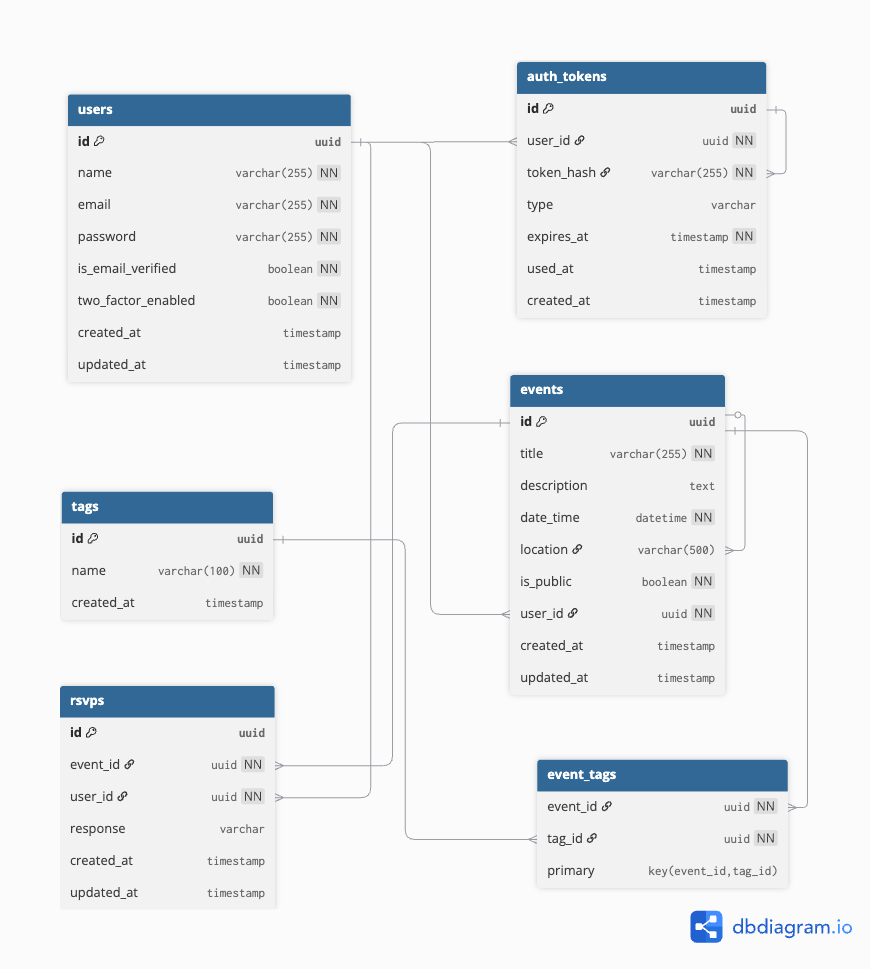

# Event Planning Application

A full-stack event planning application featuring event management, RSVP functionality, and calendar views. This application allows users to create, manage, view, and RSVP to events.


## Table of Contents

- [Features](#features)
- [Engineering Decisions](#engineering-decisions)
- [Setup Instructions](#setup-instructions)
- [Assumptions](#assumptions)

---

## Features

### Core Features
- **User Authentication** — JWT-based auth with secure refresh token rotation
- **Event Management** — Create, read, update, delete events with validation
- **Public/Private Events** — Control event visibility (public events visible to all, private to owner only)
- **Tag System** — Categorize events with reusable tags, filter by tag
- **Search & Filtering** — Full-text search, filter by time (upcoming/past), visibility, tags
- **Server-Side Pagination** — Configurable page size (max 50), sortable by date/title/created
- **Owner-Only Modification** — Only event creators can edit or delete their events

### Optional Enhancements
- **RSVP System** — Users can respond Yes/No/Maybe to event and event owners can export RSVPs as CSV
- **Calendar View** — Visual calendar showing created and attending events
- **Two-Factor Authentication** — Optional OTP-based 2FA for enhanced security
- **Email Verification and Password Reset** — Verify user email addresses with token-based flow and forgot/reset password functionality
- **Swagger Documentation** — Interactive API docs at `/api-docs`
- **Refresh Token Rotation** — HTTP-only cookie storage with automatic refresh

---

## Engineering Decisions

### 1. Backend Architecture

The backend is organized into **feature-based modules** (`auth/`, `events/`, `rsvps/`, `tags/`). Each module is self-contained with its own routes, controllers, services, and types which follows a 3-layer architecture.

```
Controllers  →  Services  →  Repositories
(HTTP layer)    (Business)    (Data access)
```

| Layer | Responsibility |
|-------|----------------|
| **Controllers** | HTTP request/response handling, Zod validation |
| **Services** | Business logic, authorization (e.g., "only owner can delete") |
| **Repositories** | Database queries via Knex, no business logic |

**Key principles:**
- **One-way dependency**: Controllers → Services → Repositories (no circular deps)
- **Stateless functions**: User context passed as params, enabling horizontal scaling
- **Validate at boundaries**: Zod validates at controller level; services trust validated inputs
- **Modular by feature**: Adding a new feature means adding a new folder, not modifying existing files

This structure is chosen as it provides a clear separation of concerns and makes the codebase easier to navigate and maintain. It also follows the Single Responsibility Principle, where each layer has a single responsibility.

Knex.js is used as a query builder instead of an ORM — it gives full control over the SQL being generated, which makes debugging and optimization straightforward. Event listing uses server-side pagination and filtering. All filtering, sorting, and search happen in MySQL using indexed columns rather than loading everything to the client.

---

### 2. Frontend Architecture & Design

The frontend mirrors the backend's modular approach with shared components, hooks, and a dedicated API service layer. It is organized into feature-based `modules/` (auth, events, calendar), with shared `components/` (AppLayout, ProtectedRoute, ErrorBoundary), custom `hooks/` (useAuth, useEvent, useRsvp), a `services/` layer for API calls, `types/` mirroring backend response shapes, and `utils/` for helper functions.

All API calls are centralized in `services/` (e.g., `getEvents()`, `createEvent()`) rather than calling axios directly from components. This gives one place to handle auth headers, error interceptors, and response typing. Frontend TypeScript interfaces in `types/` mirror the backend response shapes for compile-time safety — not auto-generated, so it needs some discipline to keep in sync.

For the UI, Ant Design is used since it has solid form, table, modal, and date picker components out of the box. Tailwind CSS handles the layout and spacing side (`flex`, `gap-4`, `md:grid-cols-2`) as Ant Design doesn't  cover that. Both together help to develop consistent design system and speed.

Shared components like `ProtectedRoute` (auth guard), `AppLayout` (navigation), and `ErrorBoundary` (error recovery) handle the cross-cutting concerns.

---

### 3. Database Schema & Normalization

The schema has 6 tables: `users`, `events`, `tags`, `event_tags`, `rsvps`, and `auth_tokens`. All primary keys are UUIDs.



| Relationship | Type | Implementation |
|--------------|------|----------------|
| User → Events | 1:N | `events.user_id` foreign key |
| Event → RSVPs | 1:N | `rsvps.event_id` foreign key |
| User → RSVPs | 1:N | `rsvps.user_id` foreign key |
| Events ↔ Tags | M:N | Junction table `event_tags` |

Events and tags have a many-to-many relationship through the `event_tags` junction table. Storing tags as a JSON array on events would have been simpler, but it would make filtering by tag slow and break normalization.

Uniqueness is enforced where it matters: `users.email` prevents duplicate accounts, `rsvps(event_id, user_id)` ensures one RSVP per user per event, and `tags.name` avoids duplicate tags. Foreign keys use `ON DELETE CASCADE` — so deleting a user removes their events, and deleting an event removes its RSVPs and tag associations.

Indexes are added on `events.date_time`, `events.is_public`, `events.user_id`, and `auth_tokens.token_hash` since those are the columns we query and sort by most frequently.

MySQL was chosen over MongoDB because the domain has clear entities with defined relationships. Foreign keys, JOINs, and ACID transactions (e.g., creating an event and attaching tags atomically) are a better fit than document-style storage.

---

### 4. Security

Authentication uses short-lived JWT access tokens (15 min) paired with a refresh token (7 days) stored in an HTTP-only cookie. The refresh token goes in a cookie because JavaScript can't access it, making it immune to XSS. When the access token expires, the Axios interceptor automatically calls the refresh endpoint to get a new one without interrupting the user.

Passwords are hashed with bcrypt (10 rounds) and never stored or logged in plaintext. Password reset and email verification use time-limited tokens (SHA-256 hashed before storage). Optional two-factor authentication is available via email OTP.

On the infrastructure side, Helmet sets secure HTTP headers, CORS is configured to only allow the frontend origin, and rate limiting is applied to auth endpoints (20 requests/15 min) and event creation (50 requests/15 min) to prevent abuse.

---

### 5. Error Handling

The backend uses a centralized error handler with a custom `AppError` class. Each error has a status code and an error code (e.g., `VALIDATION_ERROR`, `FORBIDDEN`, `NOT_FOUND`), and all responses follow a consistent format: `{ success, data }` for success or `{ success, error }` for failures.

On the frontend, a shared error handler maps these backend error codes to user-friendly messages. Components use Ant Design's `message.error()` for inline feedback, and an `ErrorBoundary` component catches unexpected render errors so the entire app doesn't crash.

---

## Setup Instructions

### Prerequisites

- Node.js 18+
- Docker and Docker Compose (for database)
- npm or yarn

### Option 1: Docker (Recommended)

Run the entire stack with Docker:

```bash
# Clone the repository
git clone <repository-url>
cd event_planner_application

# Create environment files
cp backend/.env.example backend/.env
cp frontend/.env.example frontend/.env

# Start all services (migrations run automatically on startup)
docker-compose up -d

# (Optional) Seed the database with sample data
docker exec event_planner_backend npx knex seed:run --knexfile dist/knexfile.js

# The application will be available at:
# - Frontend: http://localhost:5173
# - Backend API: http://localhost:3000
# - API Docs: http://localhost:3000/api-docs
```

### Option 2: Local Development

#### 1. Start the Database

```bash
# Start only MySQL container
docker-compose up -d mysql
```

#### 2. Setup Backend

```bash
cd backend

# Install dependencies
npm install

# Create environment file
cp .env.example .env

# Update .env with your configuration:
# - Set DB_HOST=localhost (not mysql, since running locally)
# - Generate secure JWT_SECRET and JWT_REFRESH_SECRET
# - Configure SMTP settings for email features

# Run database migrations
npm run migrate

# (Optional) Seed sample data
npm run seed

# Start development server
npm run dev
```

#### 3. Setup Frontend

```bash
cd frontend

# Install dependencies
npm install

# Create environment file
cp .env.example .env

# Start development server
npm run dev
```

#### 4. Access the Application

- Frontend: http://localhost:5173
- Backend API: http://localhost:3000/api
- Swagger Docs: http://localhost:3000/api-docs

### Environment Variables

#### Backend (`backend/.env`)

| Variable | Description | Default |
|----------|-------------|---------|
| `PORT` | Server port | `3000` |
| `NODE_ENV` | Environment | `development` |
| `DB_HOST` | MySQL host | `mysql` |
| `DB_PORT` | MySQL port | `3306` |
| `DB_USER` | Database user | `event_user` |
| `DB_PASSWORD` | Database password | `event_password` |
| `DB_NAME` | Database name | `event_planning` |
| `JWT_SECRET` | Access token secret | - |
| `JWT_REFRESH_SECRET` | Refresh token secret | - |
| `SMTP_USER` | SMTP username | - |
| `SMTP_PASS` | SMTP password | - |
| `FRONTEND_URL` | Frontend URL for email links | `http://localhost:5173` |

#### Frontend (`frontend/.env`)

| Variable | Description | Default |
|----------|-------------|---------|
| `VITE_API_URL` | Backend API URL | `http://localhost:3000/api` |

---

## Assumptions

- Docker is available for running MySQL locally. The app doesn't include a standalone MySQL installer.
- SMTP credentials are optional. If not configured, signup and login still work but email verification and password reset emails won't be sent.
- Each user can submit one RSVP per event. They can change their response (Going → Maybe) but not have multiple responses.
- Public events are browsable by anyone, including unauthenticated users. Private events only appear for the logged-in owner.
- Deleting a user cascades to their events, RSVPs, and tokens. For this project scope that's acceptable — production would use soft deletes.
- The seed script creates test users with `Password@123`. This is for demo/assessment purposes only.
- No real-time features (WebSockets). Users refresh the page to see updates from other users.
